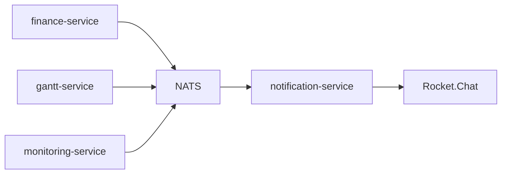

# Rocket.Chat Notification Service

Standalone Node.js/TypeScript microservice for sending notifications to Rocket.Chat.

The service accepts notification requests over HTTP and consumes typed events from NATS,
transforms them into messages, and sends them through the Rocket.Chat REST API.

## Stack

- Node.js
- TypeScript
- Fastify
- NATS
- NATS JetStream
- Zod
- dotenv
- pino
- Vitest
- ESLint
- Prettier
- tsx
- yarn

## Setup

```bash
yarn install
cp .env.example .env
```

Fill `.env` with Rocket.Chat credentials.

## Development workflow

Use `yarn` for all package and script commands.

```bash
yarn install
yarn dev
```

Before opening a pull request or pushing a branch, run:

```bash
yarn type-check
yarn lint
yarn test
```

Keep changes focused on the standalone notification service.

## Architecture overview

The service exposes HTTP endpoints for direct notification delivery and subscribes to NATS
events from internal services.



## Event architecture

NATS subjects are built as `{NATS_PREFIX}.{event}`. Incoming payloads are validated with Zod
before they are mapped to Rocket.Chat notifications.

Consumer flow:

```text
NATS event -> schema validation -> notification mapper -> notification service -> Rocket.Chat
```

Structured logs include `eventId`, `correlationId`, `subject`, `event`, `severity`, and
`source` for valid events. Invalid events are logged without forwarding to Rocket.Chat.

Every event must include a unique `eventId`. `correlationId` is optional and is preserved in
notification metadata and logs when provided.

Event processing returns an internal structured status:

- `success`
- `duplicate_skipped`
- `validation_failed`
- `mapping_failed`
- `delivery_failed`

Rocket.Chat delivery uses a bounded in-process retry policy. Defaults are 3 total attempts
with a 500 ms delay between attempts. Retry is only applied to delivery failures after event
validation and mapping have succeeded. See [docs/delivery.md](docs/delivery.md).

NATS consumers use JetStream durable consumers with explicit ack. `delivery_failed` messages
are published to `notifications.dlq` and then acknowledged to avoid infinite redelivery loops.
See [docs/jetstream.md](docs/jetstream.md).

NATS event delivery uses an in-memory idempotency guard keyed by `eventId`. Duplicate events
are skipped with result `duplicate_skipped` while the event id is still within TTL. See
[docs/idempotency.md](docs/idempotency.md).

Notification routing is handled separately from message formatting. The mapper builds
`text` and `metadata`; routing rules choose the Rocket.Chat channel. See
[docs/routing.md](docs/routing.md).

## Observability

The service exposes Prometheus-style text metrics:

```bash
curl http://localhost:4000/metrics
```

Metrics cover HTTP requests, event processing results, Rocket.Chat delivery attempts/retries,
DLQ publishes, and Rocket.Chat health checks. See [docs/observability.md](docs/observability.md).

## Container deployment

Build the service image:

```bash
docker build -t rocket-chat-notification-service:local .
```

Start Rocket.Chat and NATS:

```bash
docker compose -f docker-compose.rocketchat.yml up -d
```

Start the notification service container:

```bash
docker compose -f docker-compose.service.yml up --build
```

The service container exposes port `4000` and includes a `/health` healthcheck. See
[docs/deployment.md](docs/deployment.md) for required env, `docker run`, and endpoint details.

## Supported events

- `project.deadline.overdue`
- `project.member.overallocated`
- `finance.budget.exceeded`
- `monitoring.employee.afk`

See [docs/event-contracts.md](docs/event-contracts.md) for payload contracts.

## Local Rocket.Chat smoke test

For the full end-to-end checklist, use [docs/e2e-smoke-test.md](docs/e2e-smoke-test.md).

Start the local Rocket.Chat infrastructure:

```bash
docker compose -f docker-compose.rocketchat.yml up -d
```

Open `http://localhost:3000`, create the first admin/user, create a channel, and get a
Rocket.Chat user id and auth token. See [docs/local-rocketchat.md](docs/local-rocketchat.md)
for the full step-by-step flow.

Fill `.env` with the local Rocket.Chat values:

```bash
PORT=4000
ROCKET_CHAT_URL=http://localhost:3000
ROCKET_CHAT_USER_ID=<rocket-chat-user-id>
ROCKET_CHAT_AUTH_TOKEN=<rocket-chat-auth-token>
INTERNAL_API_KEY=<internal-api-key>
NATS_URL=nats://localhost:4222
NATS_PREFIX=notifications
NATS_STREAM_NAME=NOTIFICATIONS
NATS_DURABLE_PREFIX=rocket-chat-notification-service
NATS_DLQ_SUBJECT=notifications.dlq
DELIVERY_RETRY_ATTEMPTS=3
DELIVERY_RETRY_DELAY_MS=500
IDEMPOTENCY_TTL_MS=86400000
DEFAULT_NOTIFICATION_CHANNEL=general
FINANCE_ALERTS_CHANNEL=finance-alerts
PROJECT_ALERTS_CHANNEL_PREFIX=project-
MONITORING_ALERTS_CHANNEL=monitoring-alerts
```

Run the notification service locally:

```bash
yarn dev
```

Send a test notification:

```bash
curl -X POST http://localhost:4000/notifications/send \
  -H "Content-Type: application/json" \
  -H "x-internal-api-key: <internal-api-key>" \
  -d '{"channel":"#notifications","text":"Local Rocket.Chat smoke test"}'
```

If `INTERNAL_API_KEY` is not set, the endpoint remains open for local development and the
service logs a startup warning.

Publish a local NATS test event:

```bash
yarn publish:test-event
```

## Smoke test checklist

1. Start Rocket.Chat, MongoDB, and NATS:

```bash
docker compose -f docker-compose.rocketchat.yml up -d
```

2. Create a Rocket.Chat user and `#notifications` channel.
3. Get `userId` and `authToken` from the Rocket.Chat login API.
4. Fill `.env` with Rocket.Chat and NATS values.
5. Start the service:

```bash
yarn dev
```

6. Check service endpoints:

```bash
yarn smoke:http
```

7. Send an HTTP notification:

```bash
curl -X POST http://localhost:4000/notifications/send \
  -H "Content-Type: application/json" \
  -H "x-internal-api-key: <internal-api-key>" \
  -d '{"channel":"#notifications","text":"Local HTTP smoke test"}'
```

8. Send a NATS event:

```bash
yarn publish:test-event
```

9. Confirm the messages in Rocket.Chat and inspect DLQ if needed:

```bash
yarn dlq:last
```

## Commands

```bash
yarn dev
yarn build
yarn start
yarn type-check
yarn lint
yarn test
yarn publish:test-event
yarn dlq:last
yarn smoke:http
yarn format
```

## API

### `GET /health`

```json
{
  "status": "ok"
}
```

### `GET /ready`

Returns `200` only when the service configuration is loaded and Rocket.Chat is reachable.

```json
{
  "status": "ok",
  "rocketChat": "ok"
}
```

If Rocket.Chat is unavailable, the endpoint returns `503`.

### `GET /metrics`

Prometheus-style text exposition format.

### `POST /notifications/send`

If `INTERNAL_API_KEY` is configured, include:

```text
x-internal-api-key: <internal-api-key>
```

```json
{
  "channel": "#finance",
  "text": "Payment deadline changed"
}
```

Successful response:

```json
{
  "ok": true
}
```
